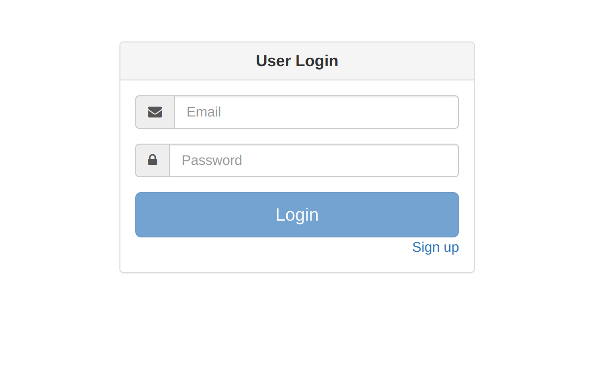

# Follow below steps to run application
```
    npm install // to install required packages
    npm start // to run application
```

In this app, we are using Backend api's on Django framework.

## Screen
